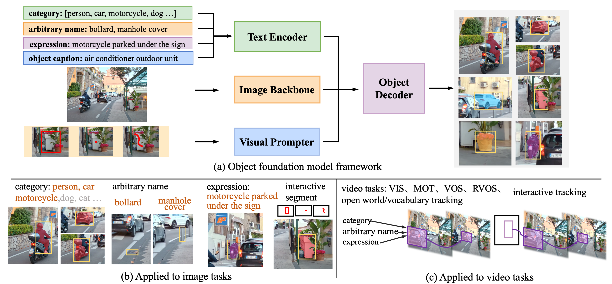
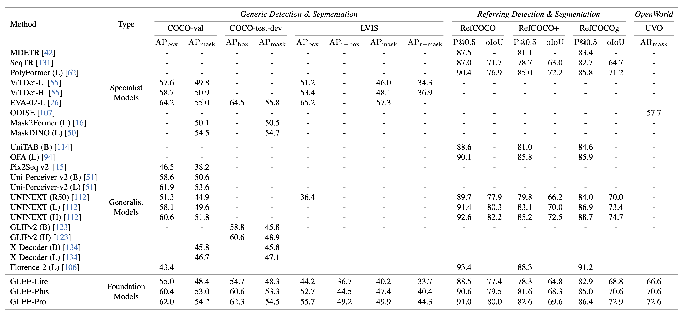
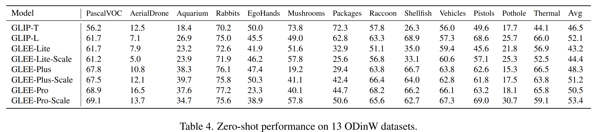
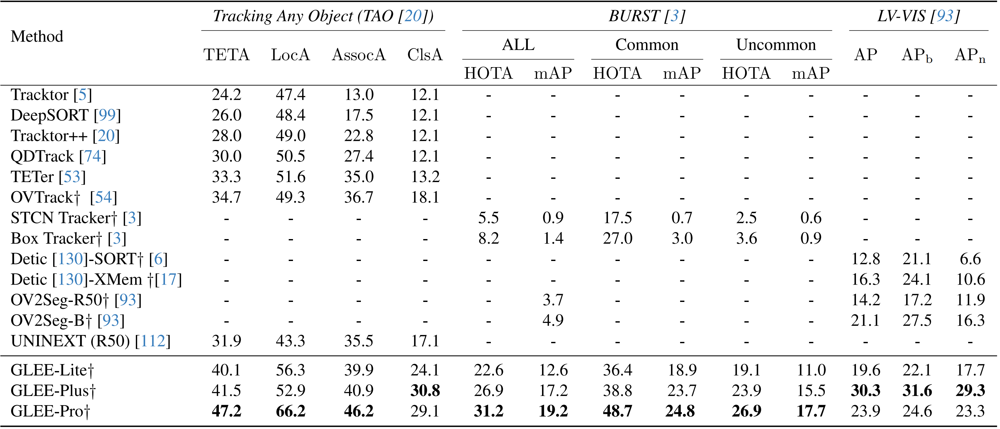
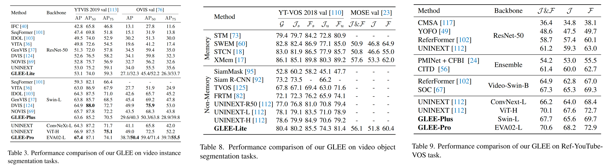

<div align=center>
  
</div>

# GLEE: General Object Foundation Model for Images and Videos at Scale

> #### Junfeng Wu\*, Yi Jiang\*,  Qihao Liu, Zehuan Yuan, Xiang Bai<sup>&dagger;</sup>,and Song Bai<sup>&dagger;</sup>
>
> \* Equal Contribution, <sup>&dagger;</sup>Correspondence

\[[Project Page](https://glee-vision.github.io/)\]  \[[Paper](https://arxiv.org/abs/2312.09158)\]    \[[HuggingFace Demo](https://huggingface.co/spaces/Junfeng5/GLEE_demo)\]   \[[Video Demo](https://youtu.be/PSVhfTPx0GQ)\]  

[](https://paperswithcode.com/sota/long-tail-video-object-segmentation-on-burst-1?p=general-object-foundation-model-for-images)
[](https://paperswithcode.com/sota/video-instance-segmentation-on-ovis-1?p=general-object-foundation-model-for-images)
[](https://paperswithcode.com/sota/referring-video-object-segmentation-on-refer?p=general-object-foundation-model-for-images)
[](https://paperswithcode.com/sota/referring-expression-segmentation-on-refer-1?p=general-object-foundation-model-for-images)
[](https://paperswithcode.com/sota/multi-object-tracking-on-tao?p=general-object-foundation-model-for-images)
[](https://paperswithcode.com/sota/open-world-instance-segmentation-on-uvo?p=general-object-foundation-model-for-images)
[](https://paperswithcode.com/sota/referring-expression-segmentation-on-refcoco?p=general-object-foundation-model-for-images)
[](https://paperswithcode.com/sota/referring-expression-segmentation-on-refcocog?p=general-object-foundation-model-for-images)
[](https://paperswithcode.com/sota/video-instance-segmentation-on-youtube-vis-1?p=general-object-foundation-model-for-images)
[](https://paperswithcode.com/sota/object-detection-on-lvis-v1-0-val?p=general-object-foundation-model-for-images)
[](https://paperswithcode.com/sota/instance-segmentation-on-lvis-v1-0-val?p=general-object-foundation-model-for-images)
[](https://paperswithcode.com/sota/referring-expression-comprehension-on-refcoco?p=general-object-foundation-model-for-images)[](https://paperswithcode.com/sota/referring-expression-segmentation-on-refcoco-3?p=general-object-foundation-model-for-images)
[](https://paperswithcode.com/sota/instance-segmentation-on-coco-minival?p=general-object-foundation-model-for-images)
[](https://paperswithcode.com/sota/referring-expression-comprehension-on?p=general-object-foundation-model-for-images)
[](https://paperswithcode.com/sota/instance-segmentation-on-coco?p=general-object-foundation-model-for-images)
[](https://paperswithcode.com/sota/referring-expression-comprehension-on-refcoco-1?p=general-object-foundation-model-for-images)


[](http://www.youtube.com/watch?v=PSVhfTPx0GQ "Video Title")


## Highlight:

- GLEE is a general object foundation model jointly trained on over **ten million images** from various benchmarks with diverse levels of supervision.
- GLEE is capable of addressing **a wide range of object-centric tasks** simultaneously while maintaining state-of-the-art performance.
-  GLEE demonstrates remarkable versatility and robust **zero-shot transferability** across a spectrum of object-level image and video tasks, and able to **serve as a foundational component** for enhancing other architectures or models.


We will release the following contents for **GLEE**:exclamation:

- [x] Demo Code
- [x] Model Checkpoint
- [ ] Comprehensive User Guide
- [ ] Training Code
- [ ] Evaluation Code


## Run the demo APP

Try our online demo app on \[[HuggingFace Demo](https://huggingface.co/spaces/Junfeng5/GLEE_demo)\] or use it locally:

```bash
git clone https://github.com/FoundationVision/GLEE
cd GLEE/app/
pip install -r requirements.txt
```

Download the pretrain weight for [GLEE-Lite](https://huggingface.co/spaces/Junfeng5/GLEE_demo/resolve/main/GLEE_R50_Scaleup10m.pth?download=true) and [GLEE-Plus](https://huggingface.co/spaces/Junfeng5/GLEE_demo/resolve/main/GLEE_SwinL_Scaleup10m.pth?download=true) 

```
# support CPU and GPU running
python app.py
```


# Introduction 

GLEE consists of an image encoder, a text encoder, a visual prompter, and an object decoder, as illustrated in Figure. The text encoder processes arbitrary descriptions related to the task, including **1) object category list 2）object names in any form 3）captions about objects 4）referring expressions**. The visual prompter encodes user inputs such as **1) points 2) bounding boxes 3) scribbles** during interactive segmentation into corresponding visual representations of target objects. Then they are integrated into a detector for extracting objects from images according to textual and visual input.




Based on the above designs, GLEE can be used to seamlessly unify a wide range of object perception tasks in images and videos, including object detection, instance segmentation, grounding, multi-target tracking (MOT), video instance segmentation (VIS), video object segmentation (VOS), interactive segmentation and tracking, and supports **open-world/large-vocabulary image and video detection and segmentation** tasks. 


# Results

## Image-level tasks





## Video-level tasks



`


# Citing GLEE

```
@misc{wu2023GLEE,
  author= {Junfeng Wu, Yi Jiang, Qihao Liu, Zehuan Yuan, Xiang Bai, Song Bai},
  title = {General Object Foundation Model for Images and Videos at Scale},
  year={2023},
  eprint={2312.09158},
  archivePrefix={arXiv}
}
```

